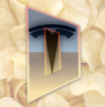

# Crispy Tesla Doom
[](https://github.com/fabiangreffrath/crispy-doom)

[](https://github.com/fabiangreffrath/crispy-doom/blob/master/COPYING.md)

This is a [Crispy Doom][1] WebAssembly port using [Emscripten][2]
Please have the latest toolchain installed or one that works to compile this.

## Compiling

Tesla Doom:

```
./scripts/clean.sh
./scripts/build.sh
```
## Running

Copy a game version of [doom1.wad][3] to [./src][5] (make sure it has the name doom1.wad) else modify the [src/index.html][4] commonArgs

Then:

```
cd src
emrun --no_browser --port 8080 index.html
```

Then open your browser and point it to http://0.0.0.0:8080/

Doom should start (local mode).

[src/index.html][4] for startup details.

Once the game is running you can redirect via YouTube to go fullscreen by clicking anywhere within the canvas.

## Special Thanks
- [Cloudflare][4] for getting the ball rolling, and giving me a better foot hold to get a Crispy port working.
- [Emscripten][0] and there coherent documentation/toolchain.

## License

Chocolate Doom and this port are distributed under the GNU GPL. See the COPYING file for more information.

[1]: https://github.com/fabiangreffrath/crispy-doom
[2]: https://emscripten.org/
[3]: https://doomwiki.org/wiki/DOOM1.WAD
[4]: src/index.html
[5]: src
[6]: https://blog.cloudflare.com/doom-multiplayer-workers/

## Synopsis

Crispy Doom is a friendly fork of [Chocolate Doom](https://www.chocolate-doom.org/wiki/index.php/Chocolate_Doom) that provides a higher display resolution, removes the [static limits](https://doomwiki.org/wiki/Static_limits) of the Doom engine and offers further optional visual, tactical and physical enhancements while remaining entirely config file, savegame, netplay and demo compatible with the original.

## Legalese

Doom is © 1993-1996 Id Software, Inc.; 
Boom 2.02 is © 1999 id Software, Chi Hoang, Lee Killough, Jim Flynn, Rand Phares, Ty Halderman;
PrBoom+ is © 1999 id Software, Chi Hoang, Lee Killough, Jim Flynn, Rand Phares, Ty Halderman,
© 1999-2000 Jess Haas, Nicolas Kalkhof, Colin Phipps, Florian Schulze,
© 2005-2006 Florian Schulze, Colin Phipps, Neil Stevens, Andrey Budko;
Chocolate Doom is © 1993-1996 Id Software, Inc., © 2005 Simon Howard; 
Chocolate Hexen is © 1993-1996 Id Software, Inc., © 1993-2008 Raven Software, © 2008 Simon Howard;
Strawberry Doom is © 1993-1996 Id Software, Inc., © 2005 Simon Howard, © 2008-2010 GhostlyDeath; 
Crispy Doom is additionally © 2014-2019 Fabian Greffrath;
all of the above are released under the [GPL-2+](https://www.gnu.org/licenses/gpl-2.0.html).

SDL 2.0, SDL_mixer 2.0 and SDL_net 2.0 are © 1997-2016 Sam Lantinga and are released under the [zlib license](http://www.gzip.org/zlib/zlib_license.html).

Secret Rabbit Code (libsamplerate) is © 2002-2011 Erik de Castro Lopo and is released under the [GPL-2+](http://www.gnu.org/licenses/gpl-2.0.html).
Libpng is © 1998-2014 Glenn Randers-Pehrson, © 1996-1997 Andreas Dilger, © 1995-1996 Guy Eric Schalnat, Group 42, Inc. and is released under the [libpng license](http://www.libpng.org/pub/png/src/libpng-LICENSE.txt).
Zlib is © 1995-2013 Jean-loup Gailly and Mark Adler and is released under the [zlib license](http://www.zlib.net/zlib_license.html).

The Crispy Doom icon (as shown at the top of this page) is composed of the [Chocolate Doom icon](https://www.chocolate-doom.org/wiki/images/7/77/Chocolate-logo.png) and a [photo](https://en.wikipedia.org/wiki/File:Potato-Chips.jpg) of potato crisps (Utz-brand, grandma's kettle-cooked style) by [Evan-Amos](https://commons.wikimedia.org/wiki/User:Evan-Amos) who kindly released it into the [public domain](https://en.wikipedia.org/wiki/Public_domain). The current high-resolution version of this icon has been contributed by JNechaevsky (formerly by Zodomaniac).
